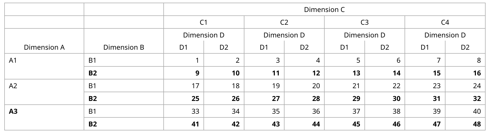
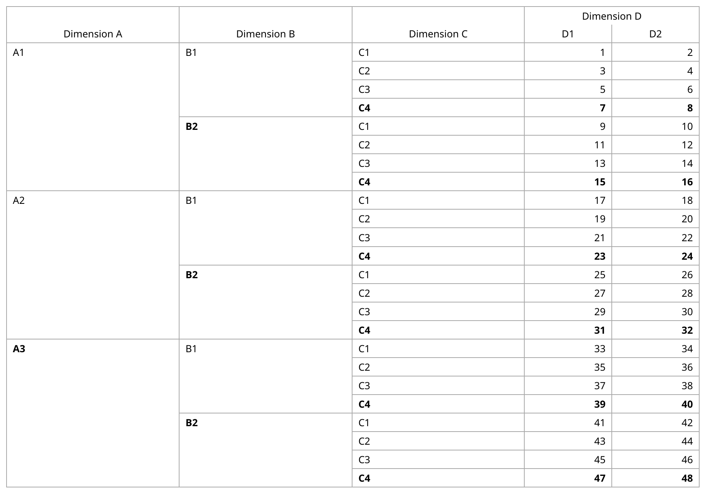
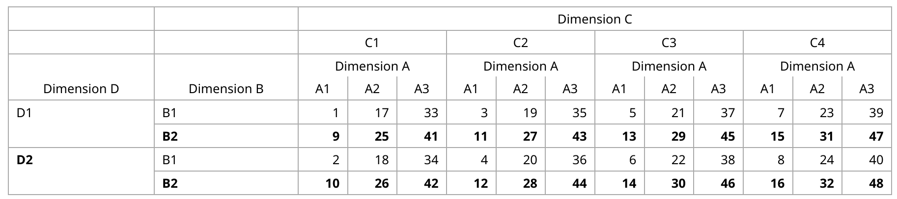
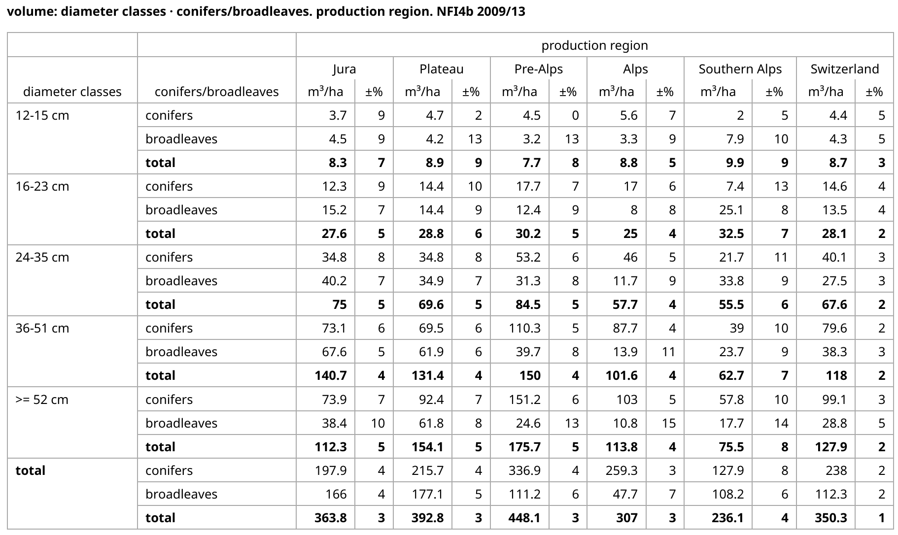

# jsonstat-phpviz
Render [JSON-stat v2.0 data](https://json-stat.org/) with any number of dimensions as an HTML table using PHP.

## Features
- render any number of dimensions of any size as an HTML table (e.g. theoretically limited only by memory).
- use any number of dimensions to group rows and columns.
- transpose dimensions along two or more axes
- structures the table with `<thead>` and `<tbody>` elements
- creates a table `<caption>` automatically from the JSON-stat.
- renders column and row headers using the attributes `scope`, `colspan` and `rowspan` to provide
screen reader support for visually impaired users
- sets CSS classes (`first` and `last`) to identify the start and end of row groups (e.g. row totals)
- exclude dimensions of size one (when ordered continuously from index 0) from rendering when wanted
- export (render) the table as tab separated values (tsv) or any character (csv) of your choosing.
- download (render) the table in the MS Excel format (xlsx)

### not implemented
- `child` property e.g., hierarchical relationships between different categories

## Usage
### Example 1
Render a table from JSON-stat data having four dimensions with sizes `[3,2,4,2]` (= shape).
Two dimensions are automatically used to group the rows:

```php
<?php

use jsonstatPhpViz\Reader;
use jsonstatPhpViz\Renderer\TableHtml;

require_once __DIR__.'/../vendor/autoload.php';

$filename = 'integer.json';
$json = file_get_contents($filename);
$jsonstat = json_decode($json);

$reader = new Reader($jsonstat);
$table = new TableHtml($reader);
$html = $table->render();
```


### Example 2
Render a table from the same JSON-stat data, but with three dimensions used for the row grouping instead:
```php
$reader = new Reader($jsonstat);
$table = new TableHtml($reader, 3);
$html = $table->render();
```


### Example 3
Transpose the table by permutating dimension A with dimension D:
```php
$reader = new Reader($jsonstat);
$axes = [3, 1, 2, 0];
$reader->transpose($axes);
$table = new TableHtml($reader);
$html = $table->render();
```
See [NumPy transpose](https://numpy.org/doc/stable/reference/generated/numpy.transpose.html) for how to use the axes array.


### Example 4
Real-world example with [data from the Swiss NFI](https://www.lfi.ch/resultate/sammlungenliste-en.php?prodNr=32&prodItNr=189147&lang=en) having a caption, column units and row totals as well as
two dimensions of size one, excluded from rendering:
```php
$reader = new Reader($jsonstat);
$table = new TableHtml($reader);
$table->excludeOneDim = true;
$table->noLabelLastDim = true;
$html = $table->render();
```


### Example 5
Render the table as comma separated values (csv):

```php
$reader = new Reader($jsonstat);
$table = new \jsonstatPhpViz\Renderer\TableTsv($reader);
$table->separatorCol = ",";
$html = $table->render();
```
## Installation
Install with `composer require lfiweb/jsonstat-phpviz` or add it to your composer.json

## Dependencies
None. But if you want to export the table in the ODF Spreadsheet (ods) or MS Excel format (xlsx), you need PhpSpreadsheet. You can install it with `composer require phpoffice/phpspreadsheet`.

## JSON-stat rendering rules
The renderer applies the following rules when generating a html table:
- the sizes of the dimensions are read from the `size` property from left to right and also rendered in that order
- dimensions 1, ..., n-2 are used to group rows (can be set manually to any number <= n)
- the second to last dimension n-1 is used as the first, outer column
- the last dimension is used as the innermost column
- the `label` property is used for the caption (can be set manually to null or any string)

## HTML inside JSON-stat
**Caution**: Do this only if you trust the origin of the JSON-stat.

The renderer (or rather the DOMDocument) escapes all html contained in the JSON-stat when inserting it into the DOM.
If you want to allow HTML inside the table cells, you need to override the classes `TableHtml` and `CellHtml` as follows:
```php
class MyRendererTable extends TableHtml
{
    /**
     * Override with the new html cell renderer.
     * @return void
     */
    protected function initRendererCell(): void
    {
        $formatter = new FormatterCell($this->reader, new Formatter());
        $this->rendererCell = new MyRendererCell($formatter, $this->reader, $this);
    }
}

class MyRendererCell extends CellHtml
{
    // render html inside label (header) cells
    public function headerCell(DOMElement $row, ?string $str = null, ?string $scope = null, ?string $colspan = null, ?string $rowspan = null): DOMElement
    {
        $cell = parent::headerCell($row, $str, $scope, $colspan, $rowspan);
        $cell->textContent = '';
        UtilHtml::append($cell, $str);

        return $cell;
    }

    // render html inside value (data) cells
    public function valueCell(DOMElement $row, int $offset): DOMNode
    {
        $cell = parent::valueCell($row, $offset);
        $cell->textContent = '';
        UtilHtml::append($cell, $this->reader->data->value[$offset]);

        return $cell;
    }
}
```

## Note:
Note 1: When rendering a table with rowspans (useRowSpans property is true),
applying css might become complicated because of the irregular number of cells per row.

Note 2: Originally, this code was directly translated from its JavaScript counterpart jsonstat-viz, but has since
been developed independently
@see https://github.com/speich/jsonstat-viz


## Author
[Simon Speich](https://www.speich.net) for the [Swiss National Forest Inventory](https://www.lfi.ch/)

## License
GNU General Public License v3.0 or later\
See [COPYING](README.md) for the full text.